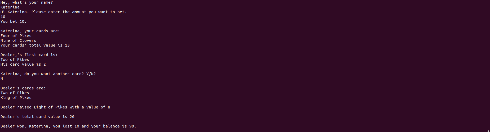

# Blackjack
This project implements the famous blackjack game, and is written in Python.

First, a deck of 52 cards is initialized and shuffled. 

The face cards are valued at 10, Ace as either 1 or 11, and the other cards are valued as their face value.

Before the dealer deals cards, the player is asked to place a bet.

After that, the dealer deals two cards face-up for the player, and two cards (one face-up and one face-down) for themself.

The player, then, decides if they want to stand (not ask for another card) or hit another card to get closer to 21.

After dealing cards to the player, the dealer turns their card face-up.

If the total value of cards adds up to 17 or more, the dealer must stand. But if the total value of cards adds up to 16 or less, the dealer takes another card.

If the dealer crosses 21, he pays double the bet to the player.

If the player crosses 21, they bust and the bet is handed to the dealer.

If the dealer's total is less than 21 and the player's total is more than the dealer's but less or equal to 21, the player wins and receives 150% of the money he bet.

If a player stands at the same total as the dealer’s, no money is given to the player.

## Game

No one wins the game

Player busts

Dealer wins

Player's card total is 21

Player wins

